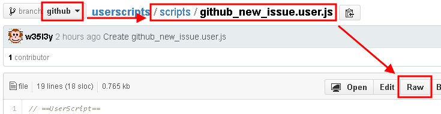

userscripts
==========

My public scripts are now here because userscripts.org is lacking on support.

## Installing
1. Make sure you are in the correct branch
2. Navigate to the script and click on it
3. With Greasemonkey enabled, click RAW

## Contributing

1. Fork it
2. Create your feature branch (`git checkout -b feature/my-new-feature`)
3. Commit your changes (`git commit -am 'Add some feature'`)
4. Push to the branch (`git push origin feature/my-new-feature`)
5. Create new Pull Request

## Acknowledgements

We are grateful to the maintainers, contributors, and sponsors of the following technologies which make Project possible:

* [github_username](/github_username)

## Reporting issues
1. Make sure you can't [contribute](#contributing)
2. Ensure your report was NOT sent by someone else (View [Issues](issues))
3. Review the [guidelines for contributing](CONTRIBUTING.md) to this repository
4. Send your report by clicking on [New Issue](issues/new)

