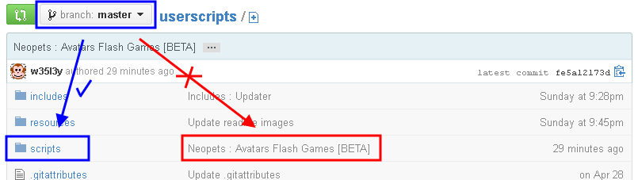
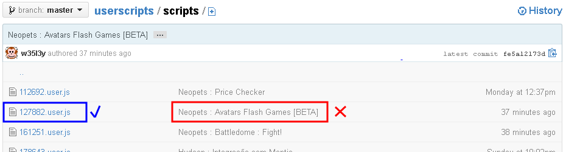
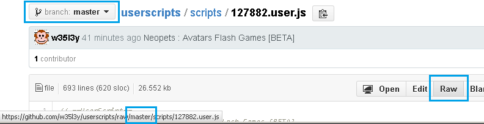

# Neopets Userscripts

# 2024 update to keep alive

neopets has gone through a revamp in 2023 so I have updated some scripts to work.

Scripts that I have tested after updating all "http://" to "https://":

- Neopets_Bank_and_Till (defunct)
- Neopets_Battledome_Fight (works)
- Neopets_Dailies_To-Do (works)
- Neopets_Dice-A-Roo (works)
- Neopets_Food_Club (works)
- Neopets_Healing_Springs (works)
- Neopets_Quick_Price_Checker (works)
- Neopets_Shop_Wizard_Improved_Search (works)

---

Check out other scripts

My public scripts are now here because userscripts.org is lacking on support.

## Installing

1. Make sure you are in the correct branch (normally [master/scripts](scripts))
   
2. Navigate to the script by the correct way and click on it
   
3. Make sure when you hover mouse over RAW button the link shows the correct branch name
    **Correct way**
   
    **Incorrect way**
   
4. With Greasemonkey enabled, click RAW

## Contributing

1. Fork it
2. Create your feature branch (`git checkout -b feature/my-new-feature`)
3. Commit your changes (`git commit -am 'Add some feature'`)
4. Push to the branch (`git push origin feature/my-new-feature`)
5. Create new Pull Request

## Acknowledgements

We are grateful to the maintainers, contributors, and sponsors of the following technologies which make Project possible:

- [github_username](https://github.com/github_username)

## Reporting issues

1. Make sure you can't [contribute](#contributing)
2. Ensure your report was NOT sent by someone else (View [Issues](../../issues))
3. Review the [guidelines for contributing](CONTRIBUTING.md) to this repository
4. Send your report by clicking on [New Issue](../../issues/new)

