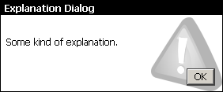
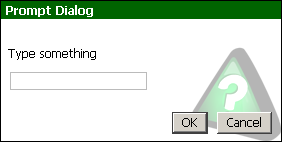
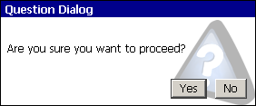
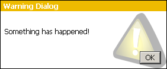

# [Includes : WinConfig](.)

**Summary:** WinConfig Function<br />
**License:** GNU GPL<br />
[](https://goo.gl/DNfg2w)
### Usage
```
// @grant          GM_log
// @grant          GM.log
// @grant          GM_addStyle
// @grant          GM.addStyle
// @grant          GM_getValue
// @grant          GM.getValue
// @grant          GM_setValue
// @grant          GM.setValue
// @grant          GM_deleteValue
// @grant          GM.deleteValue
// @grant          GM_getResourceText
// @grant          GM.getResourceText
// @resource       winConfigCss https://github.com/w35l3y/userscripts/raw/master/scripts/X/../../includes/Includes_WinConfig/resources/default.css
// @require        https://greasemonkey.github.io/gm4-polyfill/gm4-polyfill.js
// @require        https://github.com/w35l3y/userscripts/raw/master/scripts/../../../raw/master/includes/Includes_WinConfig/163374.user.js
```

### Screenshots







